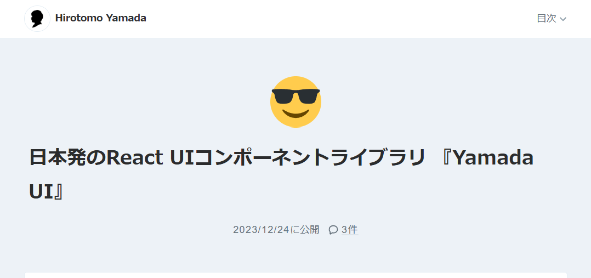
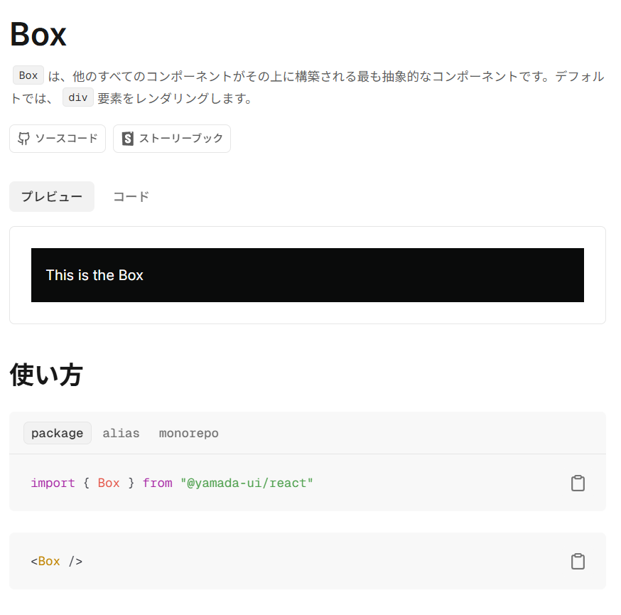
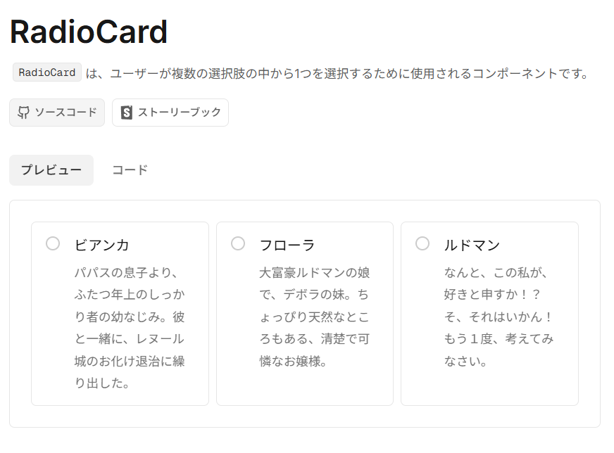
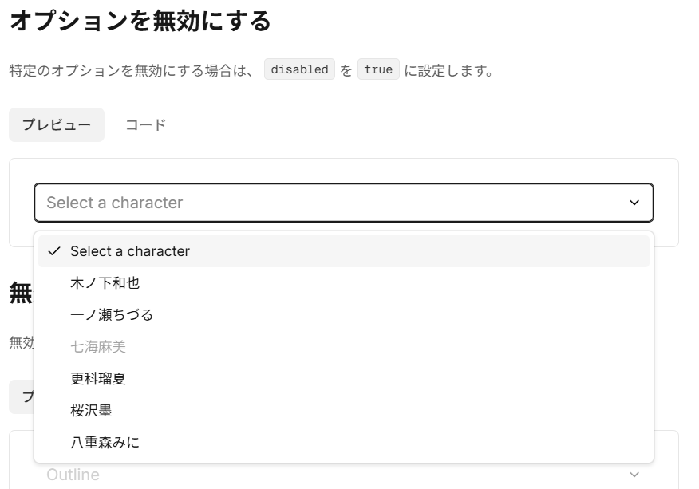
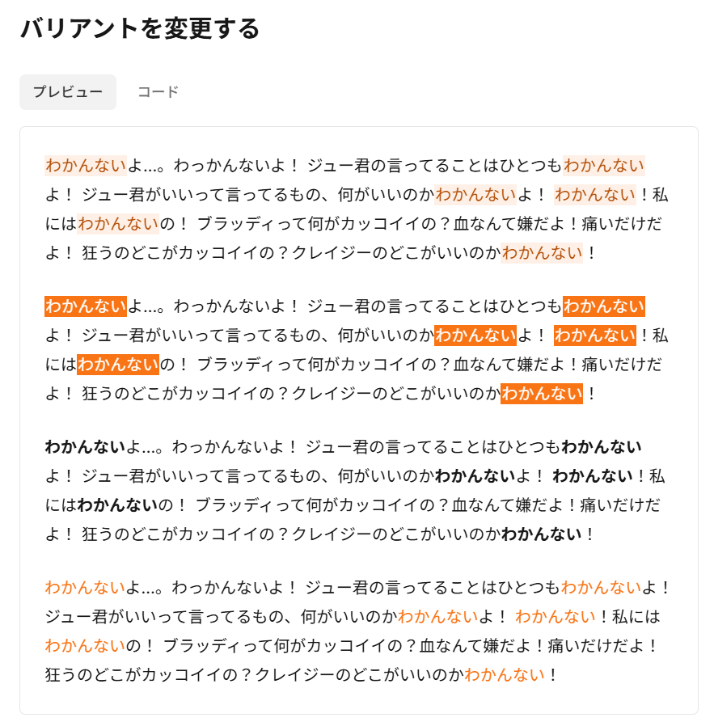
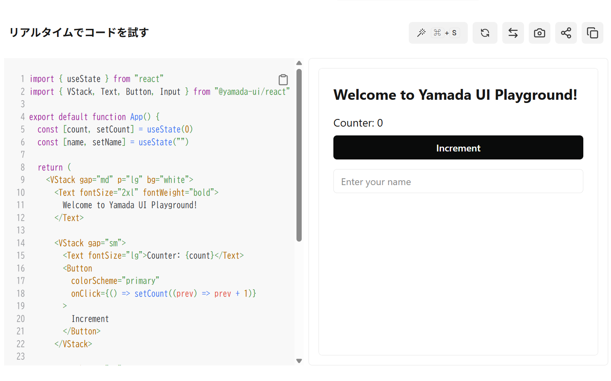

  <h2>
  Yamada UIドキュメント v2紹介
</h2>

  〜メンテナー視点で語る魅力〜

  じょうげん / React Tokyo 2025

---

## 私は誰？

👋 じょうげん と申します

- フリーランスエンジニア
- React Tokyo サポーター
- Yamada UI メンテナー
- React Tokyo きっかけでYamadaさんと出会う

---

## もとは一人のユーザー

当時参画していたプロジェクトで **私が技術選定し、Yamada UIを採用しました。**

その後、React TokyoでYamadaさんとお会いし、 「一緒にやりませんか？」とお声がけいただいたのが始まりです。

<!-- そのときYamadaさんが言っていた、「Yamada UIを本番で使うのは頭がおかしい」という言葉は今でも覚えています！ -->

---

## なぜYamada UIを採用したのか

YamadaさんのZenn記事を読んで
「これだ！」と思いました。

- **StyleProp** で柔軟にスタイル指定できる
- コンポーネントを**組み合わせて使える自由度**
- **記述がシンプルで読みやすい**
- 日本人作者ならではの丁寧な思想

---

## ドキュメントの魅力

Yamada UIのドキュメントは
**UIライブラリの中でも特に充実**しています。

- Hooksや内部ユーティリティまで網羅
- 実装の背景や設計思想も書かれていて学びが多い
- Yamada UIを使って作られている
- もちろん、すべて日本語で読める

---

## 小ネタが盛りだくさん

ドキュメントには、**小ネタがたくさん**詰まっています。

<!-- Radioなので、誰か一人しか選べません -->

---

<!-- 麻美ちゃんが無効化されています。なぜでしょうか？ -->

---

<!-- わかんないですね。 -->

---

## V2のいちおし機能「Playground」

🎉 インタラクティブなPlaygroundが登場予定！

- コンポーネントをブラウザ上で自由に試せる
- コードを編集すれば、リアルタイムで結果をプレビュー
- Issue報告や動作確認がもっと簡単に

---

## Playground開発秘話

実はこのPlayground、
**v1時代から私が「欲しい」と思っていた機能**なんです。

- Issueを立てたのも私
- 実装を担当したのも私

> ただし…デザイン面でYamadaさんにダメ出し中💦
> （リリースに間に合いませんでした！）

---

## まとめ

💎 **Yamada UIは最高のライブラリです！**

- 柔軟で気持ちいい開発体験
- 丁寧な設計と思いやり
- Playgroundでもっと楽しく触れる

ぜひ、触ってみてください！

👉 [https://yamada-ui.com](https://yamada-ui.com)

Discordもあります！

---

## ご清聴ありがとうございました！
