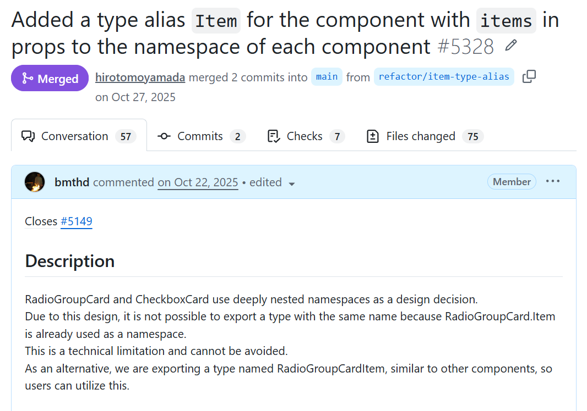

<!-- _class: title -->
<!-- _paginate: false -->

# 値・型・名前空間の「三重定義」で
# Reactコンポーネントをより柔軟に設計する

TypeScript コンパニオンオブジェクト活用術

<div style="position: absolute; bottom: 28px; left: 36px; display: flex; gap: 16px; align-items: center;">
  <div style="position: relative; background: white; border-radius: 12px; padding: 8px 16px; display: inline-flex; align-items: center;">
    
    <div style="position: absolute; inset: 0; border-radius: 12px; background: linear-gradient(to bottom right, transparent calc(50% - 3px), #dd2222 calc(50% - 3px), #dd2222 calc(50% + 3px), transparent calc(50% + 3px)), linear-gradient(to bottom left, transparent calc(50% - 3px), #dd2222 calc(50% - 3px), #dd2222 calc(50% + 3px), transparent calc(50% + 3px));"></div>
  </div>
  <div style="display: flex; align-items: center; gap: 12px;">
    
    <div style="color: white; font-size: 0.9em;">じょうげん / React Tokyo ミートアップ #16</div>
  </div>
</div>

---

## コンパニオンオブジェクトとは？

型（Type）と値（Value）を**同じ名前**で定義するテクニック

```ts
export type Rectangle = {
  height: number;
  width: number;
};

export const Rectangle = {
  from(height: number, width: number): Rectangle {
    return { height, width };
  },
};

// 型としても、値としても「Rectangle」という名前で使える
const rect: Rectangle = Rectangle.from(1, 3);
```

[サバイバルTypeScript](https://typescriptbook.jp/tips/companion-object) でも紹介されている定番パターン

---

## なぜ成立するのか — Declaration Merging

TypeScript には異なる種類の宣言を同名でマージする機能がある

| 宣言空間 | 構文例 |
|---------|--------|
| **Type** | `interface`, `type alias` |
| **Value** | `const`, `function`, `class` など |
| **Namespace** | `namespace` |

異なる宣言空間に属する宣言は、同名でも**衝突せず 1 つのエンティティ**に統合される

> `class` や `enum` は型と値の両方を単独で生成するため、  
> それ自体がコンパニオンオブジェクト的な振る舞いをする

---

<!-- _class: accent -->

# 実は…

名前空間（Namespace）も加えた

# 「**三重定義**」ができる！

---

## 三重定義の構造

```ts
// 1. 型（Type）— データ構造の定義
export interface Item {
  name?: string;
}

// 2. 名前空間（Namespace）— 関連する型を格納するコンテナ
export namespace Item {
  export interface Props extends Item, React.PropsWithChildren {}
}

// 3. 値（Value）— コンポーネント本体
export const Item: React.FC<Item.Props> = ({ name, children }) => (
  <li>{name ?? children}</li>
);
```

`Item` という **1 つの名前** が型・名前空間・値の 3 役をこなす

---

## 実践例：List コンポーネントの設計

```tsx
namespace List {
  // Root — 名前空間 + 値
  export namespace Root {
    export interface Props extends React.PropsWithChildren {
      items?: Item[];   // ← Item は「型」として参照
    }
  }
  export declare const Root: React.FC<Root.Props>;

  // Item — 型 + 名前空間 + 値（三重定義）
  export interface Item extends React.HTMLAttributes<HTMLLIElement> {
    name?: string;
  }
  export namespace Item {
    export interface Props extends Item, React.PropsWithChildren {}
  }
  export declare const Item: React.FC<Item.Props>;
}
```

---

## ユースケース① データ駆動（シンプルに使う）

`List.Item` を**型**として使い、データを渡すだけで描画する

```tsx
const FruitsList = (props: List.Root.Props) => {
  // List.Item は「型」として機能
  const items = useMemo<List.Item[]>(() => [
    { name: "apple" },
    { name: "banana" },
    { name: "orange" },
  ], []);

  // データを流し込むだけ — JSX を書かなくてよい
  return <List.Root {...props} items={items} />;
};
```

アプリ独自の薄いカスタマイズを乗せた**「設定済みの部品」**を手軽に作れる

---

## ユースケース② JSX 駆動（細かくカスタマイズ）

`List.Item` を**コンポーネント（値）**として直接配置する

```tsx
const FruitsList = () => {
  // List.Item.Props は「名前空間」の中の型
  const itemProps = useMemo<List.Item.Props>(() => ({}), []);

  return (
    <List.Root>
      {/* List.Item は「値（コンポーネント）」として使われる */}
      <List.Item {...itemProps} name="apple"  className="bg-red" />
      <List.Item {...itemProps} name="banana" className="bg-yellow" />
      <List.Item {...itemProps} name="orange" className="bg-orange" />
    </List.Root>
  );
};
```

個別スタイル・特定アイテムへの別挙動など**高度な組み込み**に最適

---

## 名前が統一されるメリット

どちらの使い方でも **`List.Item`** という同じ名前を使える

| 利用場面 | 参照対象 | 役割 |
|----------|---------|------|
| `List.Item[]` | 型 | データ構造の定義 |
| `<List.Item />` | 値 | JSX コンポーネント |
| `List.Item.Props` | 名前空間 | Props 型の格納先 |

コンテキストスイッチなしに実装スタイルを選択できる

---

## 注意点① — namespace は「型のみ」にする

`namespace` に値を含めると**コンパイル後の JS にも出力**されてしまう

```ts
// ❌ NG: namespace 内に値（関数・オブジェクト）がある
namespace List {
  export const helper = () => {};  // → JS に即時関数として出力
  export const Item: React.FC = () => <li />;  // → const List と衝突！
}
```

TypeScript は `namespace` が**型情報しか持たない**（= JS 出力なし）と  
判断した場合のみ、同名の `const` とのマージを許可する

> `import * as` による代替も、インポート先が「型のみ」と保証できないため  
> 完全なコンパニオンオブジェクトにはならない

---

## 注意点② — 宣言順序の罠

型・名前空間・値が**離れた位置**にあるとコンパイルエラーになることがある

```ts
// ❌ バッドパターン：宣言が分散している
export interface Item { name?: string; }

// ... 間に別のコードが入る ...

export namespace Item { ... }  // "Duplicate identifier 'Item'" が発生する可能性
```

```ts
// ✅ グッドパターン：同名の宣言はセットで隣り合わせにする
export interface Item { name?: string; }
export namespace Item { export interface Props extends Item {} }
export const Item: React.FC<Item.Props> = () => <li />;
```

**同名の宣言は隣り合わせにグルーピング**するのが鉄則

---

## まとめ

TypeScript の「三重定義」を活用すると…

- 1 つの名前で**型・名前空間・値**を統一でき API がシンプルになる
- **データ駆動**（`items` を渡すだけ）と**JSX 駆動**（細かく配置）をシームレスに切り替えられる
- OSSライブラリのような**洗練されたコンポーネント API**をアプリコードでも実現できる

守るべき作法

| | ルール |
|--|--------|
| `namespace` | 型のみを格納（ランタイム影響を排除） |
| 宣言順序 | 同名の宣言は隣り合わせてグルーピング |

---

## このパターンを採用しているライブラリ — Yamada UI

実際にこの設計パターンを PR してマージされました！

https://github.com/yamada-ui/yamada-ui/pull/5328

<div style="display: flex; gap: 48px; align-items: center; justify-content: center; margin-top: 0.5em;">



<div style="text-align: center; flex-shrink: 0;">


<small>TS Playground</small>
</div>
</div>
---
