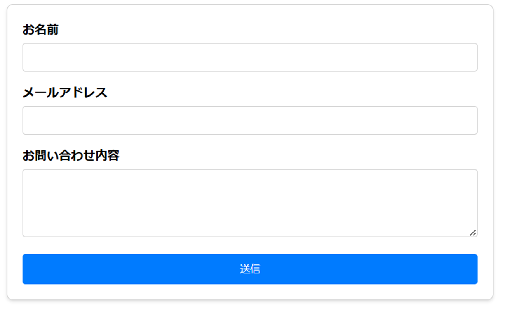

## formの複雑さに立ち向かう

---

## 自己紹介

Reactが大好き

---

## Agenda

---

<!-- 
状態管理の定番といえばRedux、状態管理の新定番といえばJotaiですよね。
それと同様に、フォームの定番といえばreact-hook-formですが、新定番のConformを紹介していきたいと思います。
 -->

## formの悩み



---

## 従来のHTMLにおけるformといえば…

```html
  <div class="form-container">
    <form id="inquiryForm" action="https://example.com/api/inquiry" method="post">
      <div class="form-group">
        <label for="name">お名前</label>
        <input type="text" id="name" name="name" autocomplete="name" required>
      </div>
      <div class="form-group">
        <label for="email">メールアドレス</label>
        <input type="email" id="email" name="email" autocomplete="email" required>
      </div>
      <div class="form-group">
        <label for="message">お問い合わせ内容</label>
        <textarea id="message" name="message" rows="5" required></textarea>
      </div>
      <div class="button-container">
        <button type="submit" id="submitButton">送信</button>
      </div>
    </form>
  </div>
```

<!-- 
状態管理はブラウザが行ってくれるため、フォームの実装はシンプルです。
動的な要素はJavaScriptを使って書き換えを行うため、見た目の実装に集中することができます。
これぐらいシンプルに書きたい…。
 -->

---

```tsx
import { useForm } from "react-hook-form";
import { Button, HStack, VStack, Label, Input, Textarea, ErrorMessage } from "@yamada-ui/react";
import { FC } from "react";
import { inquiryFormSchema, type InquiryForm } from "../schema";
import { inquiryAction } from "./actions";
import { valibotResolver } from "@hookform/resolvers/valibot";

export const InquiryForm: FC = () => {
  const {
    register,
    handleSubmit,
    formState: { isSubmitting, errors },
  } = useForm<InquiryForm>({
    resolver: valibotResolver(inquiryFormSchema),
  });

  return (
    <form onSubmit={handleSubmit(inquiryAction)}>
      <VStack>
        <Label>
          お名前
          <Input
            {...register("name")}
            type="text"
            autoComplete="name"
            required
            maxLength={255}
          />
        </Label>
        {errors.name && <ErrorMessage>{errors.name.message}</ErrorMessage>}
        <Label>
          メールアドレス
          <Input
            {...register("email")}
            type="email"
            autoComplete="email"
            required
            maxLength={255}
            pattern="^[^\s@]+@[^\s@]+\.[^\s@]+$"
          />
        </Label>
        {errors.email && <ErrorMessage>{errors.email.message}</ErrorMessage>}
        <Label>
          お問い合わせ内容
          <Textarea {...register("message")} required/>
        </Label>
        {errors.message && <ErrorMessage>{errors.message.message}</ErrorMessage>}
        <HStack alignSelf="end">
          <Button type="submit" loading={isSubmitting}>
            送信
          </Button>
        </HStack>
      </VStack>
    </form>
  );
};
```

<!-- 
※こちらは疑似コードのため、動作確認などは行っておりません。
説明のために1ページにまとめているため、実際のコードは複数のファイルに分割されていることがあります。
とにかくやることが多い。
UI構築、入力バリデーション、状態管理、送信バリデーション、送信処理
特に、register関数の使い方が独特であり、JSXが複雑になりがちです。
 -->

---

## Conformを使うとここまで削れます！

```tsx
import { Form, TextareaField, TextField } from "@/ui/form";
import { Button, HStack, VStack } from "@yamada-ui/react";
import { FC, useActionState } from "react";
import { inquiryFormSchema } from "../schema";
import { inquiryAction } from "./actions";

export const InquiryForm: FC = () => {
  const [state, dispatch, isPending] = useActionState(inquiryAction, {
    status: "idle",
  });

  return (
    <Form
      schema={inquiryFormSchema}
      action={dispatch}
      options={{ lastResult: state.submissionResult }}
    >
      {({ field }) => (
        <VStack>
          <TextField name={field.name.name} label="お名前" autoComplete="name" />
          <TextField name={field.email.name} label="メールアドレス" autoComplete="email" />
          <TextareaField name={field.message.name} label="お問い合わせ内容" />
          <HStack alignSelf="end">
            <Button type="submit" loading={isPending}>
              送信
            </Button>
          </HStack>
          <FormDebug />
        </VStack>
      )}
    </Form>
  );
};
```

---

## Conformのご紹介

Conformは、Server Actionsを前提に設計された新世代のフォームライブラリです。

```tsx
import { useForm, getInputProps } from '@conform-to/react';

function Example() {
  const [form, fields] = useForm();

  return (
    <form>
      <input {...getInputProps(fields.password, { type: 'password' })} /> {/* Conformのユーティリティで一括設定 */}
      <input name={fields.password.name} /> {/* Conformの型推論で設定 */}
      <input name="password" /> {/* 手動で設定 */}
    </form>
  )
}
```

<!-- 
ReactHookFormとの違いは、ライブラリへの登録方法です。
rhfではregister関数を使ってref経由で登録するのに対し、ConformではgetXXProps関数を使ってname属性を登録します。
コンポーネントは独自の実装を必要とせず、一般的なname属性させ指定することができればそれだけで動作するようになります。
getXXPropsは入力欄の種類ごとに用意されており、それぞれの入力欄に適した属性を一括で設定することができます。
これには、name属性、id、制約、アクセシビリティ属性などが含まれます。
RHFでは手動で設定していた制約をスキーマから導出することができ、更にはアクセシビリティにも対応できるのが決定的な違いとなります。
余談となりますが、内部実装は最近のライブラリによく見られるvanillaJSでの実装のため、今後React以外のライブラリへ対応できる余地が残されています。

状態管理は、HTMLが持つ値をFormData経由で取得する方法のため、再レンダリングを必要とせず、デフォルトでパフォーマンスが良いです。
必要に応じてFormの持つ値にアクセスすることも可能です。
 -->

---

## Conformと実装吸収層で実現する、シンプルなform実装


```tsx
export const TextField: FC<TextFieldProps> = ({ name = "", label, helperMessage, ...props }) => {
  const [fieldMeta] = useField(name);
  return (
    <CustomFormControl {...{ label, helperMessage }} {...getFieldErrorProps(fieldMeta)}>
      <Input {...props} {...getInputProps(fieldMeta, { type: "text" })} key={fieldMeta.key} />
    </CustomFormControl>
  );
};
```

<!-- 
実装吸収層について
この名前は私が勝手に呼んでいるものですが、概念の紹介のために利用させてください。
最初に紹介したreact-hook-formのコードでは、Formレイアウト層に直接Formライブラリの実装に関連するコードを書いていました。
react-hook-formの場合は、register関数をInputコンポーネントに登録する処理、Conformの場合はgetInputPropsがそれに該当します。
これらを実装吸収層に移動することで、Formレイアウト層はUIライブラリに集中することができます。
ラベルやエラーメッセージなどの繰り返しになりがちなコードもここでまとめて渡してしまうことができます。 
-->

---

## Conformであれば、以下のコードはそのまま動きます

```tsx
(
  <Form>
    <VStack>
      <TextField label="お名前" autoComplete="name" />
      <TextField label="メールアドレス" autoComplete="email" />
      <TextareaField label="お問い合わせ内容" />
      <HStack alignSelf="end">
        <Button type="submit">送信</Button>
      </HStack>
    </VStack>
  </Form>
)
```

プロトタイピングに便利

<!-- 
こちらはスキーマが未定義であり、設定する制約やバリデーションがまだ存在しない状態をイメージしています。
refを必要とするライブラリでは、refを登録するために必要なコードを事前に定義する必要があるため、プロトタイピングの際には中間層のコンポーネントを使うことができません。
これは、条件分岐をhookに使えないReactの制約です。
Conformの場合はname属性を持つ入力欄を探索する方式を採用しているため、空文字にしてしまえばよいです。
このようなコードでも、型エラーや実行時エラーが出ること無くそのまま動作します。
 -->

---


---

見た目　UIライブラリまたは、自作コンポーネント

状態管理　Conformが内部で実装

検証ロジック　schemaで定義し、Conformが適用

フォーム配置　先程のコードで実装

データ処理　サーバー側コード(Actionsまたはバックエンド API)

フィードバック　schemaで定義されたエラーメッセージをConformが表示

---

## その他のConformの嬉しみ

- Selectコンポーネント、動的入力欄、チェックボックスグループなどの複雑なUIにもデフォルトで対応
- 同期的に入力値にアクセスしたい場合はFormData経由で取得できる
- リアクティブな状態へのアクセスももちろん可能！
- アクセシビリティ属性を自動でセット
- サーバー側検証対応。フロントとバックでスキーマ共有や、バンドルサイズ圧縮が可能
- Progressive Enhancement
- サーバーでしか行えない検証をシームレスに実装可能
- SPAでの利用ももちろん可能

---

## まとめ

Conformは、フォームの複雑さに立ち向かうための新しい選択肢です。
ReactHookFormと比較して実装がシンプルであり、UIの構築に集中することができます。

### リンク

- [Conformドキュメント](https://conform.guide/)
- [紹介した実装の動作サンプル](https://exp.bmth.dev/)