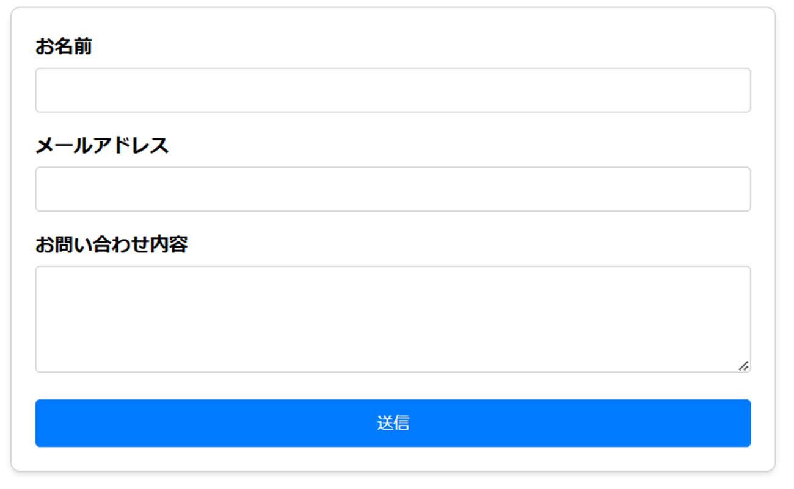
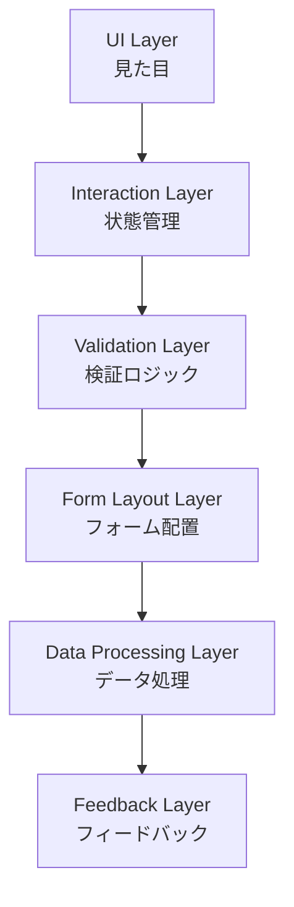

## formの複雑さに立ち向かう

---

## 自己紹介

---

## Agenda

---

## 状態管理といえば…

Redux -> Jotai

---

## ではformの状態管理といえば？

react-hook-form -> Conform

---

## formの悩み

```tsx
"use client";

import { useState } from "react";
import { TextField, Button, Stack } from "@mui/material";

export const InquiryForm = () => {
  const [formData, setFormData] = useState({ name: "", email: "", message: "" });
  const [errors, setErrors] = useState({ name: "", email: "", message: "" });
  const [isSubmitting, setIsSubmitting] = useState(false);

  const validate = () => {
    let newErrors = { name: "", email: "", message: "" };
    let isValid = true;

    if (!formData.name) {
      newErrors.name = "お名前は必須です";
      isValid = false;
    }
    if (!formData.email) {
      newErrors.email = "メールアドレスは必須です";
      isValid = false;
    } else if (!/^[^\s@]+@[^\s@]+\.[^\s@]+$/.test(formData.email)) {
      newErrors.email = "正しいメールアドレスを入力してください";
      isValid = false;
    }
    if (!formData.message) {
      newErrors.message = "お問い合わせ内容は必須です";
      isValid = false;
    }

    setErrors(newErrors);
    return isValid;
  };

  const handleChange = (e) => {
    const { name, value } = e.target;
    setFormData((prev) => ({ ...prev, [name]: value }));
  };

  const handleSubmit = async (e) => {
    e.preventDefault();
    if (!validate()) return;

    setIsSubmitting(true);
    console.log(formData);
    // APIリクエスト処理などをここに追加
    setIsSubmitting(false);
  };

  return (
    <form onSubmit={handleSubmit}>
      <Stack spacing={2}>
        <TextField
          name="name"
          label="お名前"
          value={formData.name}
          onChange={handleChange}
          error={!!errors.name}
          helperText={errors.name}
          fullWidth
        />
        <TextField
          name="email"
          label="メールアドレス"
          value={formData.email}
          onChange={handleChange}
          error={!!errors.email}
          helperText={errors.email}
          fullWidth
        />
        <TextField
          name="message"
          label="お問い合わせ内容"
          value={formData.message}
          onChange={handleChange}
          multiline
          minRows={3}
          error={!!errors.message}
          helperText={errors.message}
          fullWidth
        />
        <Button type="submit" variant="contained" disabled={isSubmitting}>
          送信
        </Button>
      </Stack>
    </form>
  );
};
```

---

```tsx
export const InquiryForm = () => {
  const {
    control,
    handleSubmit,
    formState: { errors, isSubmitting },
  } = useForm({
    resolver: zodResolver(inquiryFormSchema),
  });

  const onSubmit = async (data) => {
    console.log(data);
  };

  return (
    <form onSubmit={handleSubmit(onSubmit)}>
      <Stack spacing={2}>
        <Controller
          name="name"
          control={control}
          render={({ field }) => (
            <TextField {...field} label="お名前" error={!!errors.name} helperText={errors.name?.message} fullWidth />
          )}
        />
        <Controller
          name="email"
          control={control}
          render={({ field }) => (
            <TextField {...field} label="メールアドレス" error={!!errors.email} helperText={errors.email?.message} fullWidth />
          )}
        />
        <Controller
          name="message"
          control={control}
          render={({ field }) => (
            <TextField
              {...field}
              label="お問い合わせ内容"
              multiline
              minRows={3}
              error={!!errors.message}
              helperText={errors.message?.message}
              fullWidth
            />
          )}
        />
        <Button type="submit" variant="contained" disabled={isSubmitting}>
          送信
        </Button>
      </Stack>
    </form>
  );
};
```

<!-- ボイラープレートコードが多すぎる！ -->

---

## 従来のHTMLにおけるformといえば…



---

```html
  <div class="form-container">
    <form id="inquiryForm">
      <div class="form-group">
        <label for="name">お名前</label>
        <input type="text" id="name" name="name" autocomplete="name" required>
      </div>
      <div class="form-group">
        <label for="email">メールアドレス</label>
        <input type="email" id="email" name="email" autocomplete="email" required>
      </div>
      <div class="form-group">
        <label for="message">お問い合わせ内容</label>
        <textarea id="message" name="message" rows="5" required></textarea>
      </div>
      <div class="button-container">
        <button type="submit" id="submitButton">送信</button>
      </div>
    </form>
  </div>
```

<!-- これぐらいシンプルに書きたい -->

---

## ここまで削れます

```tsx
"use client";
import { Form, TextareaField, TextField } from "@/ui/form";
import FormDebug from "@/ui/form/debug";
import { Button, HStack, VStack } from "@yamada-ui/react";
import { FC, useActionState } from "react";
import { inquiryFormSchema } from "../schema";
import { inquiryAction } from "./actions";

export const InquiryForm: FC = () => {
  const [state, dispatch, isPending] = useActionState(inquiryAction, {
    status: "idle",
  });

  return (
    <Form
      schema={inquiryFormSchema}
      action={dispatch}
      options={{ lastResult: state.submissionResult }}
    >
      {({ field }) => (
        <VStack>
          <TextField name={field.name.name} label="お名前" autoComplete="name" />
          <TextField name={field.email.name} label="メールアドレス" autoComplete="email" />
          <TextareaField name={field.message.name} label="お問い合わせ内容" />
          <HStack alignSelf="end">
            <Button type="submit" loading={isPending}>
              送信
            </Button>
          </HStack>
          <FormDebug />
        </VStack>
      )}
    </Form>
  );
};
```

---


---