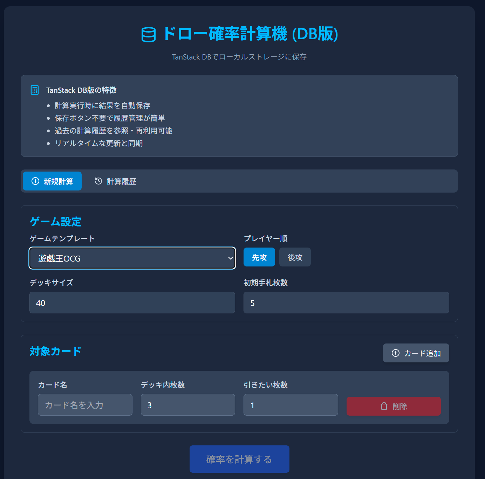

<h1 style="position: static; margin: 0 auto; max-width: fit-content; text-align: center;">TanStack DB ~状態管理の新しい考え方~</h1>

---

## TanStackファミリー

<div style="display: flex; align-items: center; gap: 40px;">
  <div style="flex: 1; text-align: center;">
    
  </div>
  <div style="flex: 2;">
    <ul>
      <li><strong>TanStack Query</strong> - Server State Management</li>
      <li><strong>TanStack Router</strong> - Type-Safe Routing</li>
      <li><strong>TanStack Table</strong> - Headless Table Building</li>
      <li><strong>TanStack Form</strong> - Headless Form Building</li>
      <li><strong>TanStack DB</strong> - Client-Side Database ← <strong>NEW!</strong></li>
    </ul>
  </div>
</div>

---

# TanStack DBとは？

* フロントエンドに **永続化層(DB)** を設けてコンポーネントからクエリする
* **クエリファーストなAPI**
* React だけでなく **Vue / Svelte / Solid** など多数のUIフレームワークをサポート

---

# 設計思想

**Client Side Querying**
  → データ取得の主導権をフロント側へ

---

# Reactでの使い方の例

```ts
export const drawCalcCollection = createCollection(
  localStorageCollectionOptions({
    storageKey: "tcg-tool-draw-calculations",
    id: "draw-calculations",
    getKey: (item) => item.id,
    schema: drawCalcSchema
  }),
);
```

* Collectionという単位でデータの永続化を定義
* ZodやValibotなどでランタイムバリデーションありの型定義可能

---

```ts
const { data } = useLiveQuery((q) =>
  q
    .from({ calculations: calculationsCollection })
    .where(({ calculations }) => eq(calculations.id, calculationId)),
);
```

* DrizzleのようなSQLライクなセレクター
* 型安全なクエリビルダー
* クエリで絞り込まれた箇所のみの部分的な**Subscribe**を実現

---

## コンポーネントで使う

```tsx
const CalculationItem = ({ calculationId }: { calculationId: string }) => {
  const { data } = useLiveQuery((q) =>
    q.from({ calculations: calculationsCollection })
      .where(({ calculations }) => eq(calculations.id, calculationId)),
  );
  const firstCalculation = data[0];
  if (!firstCalculation) return <FallbackItem />;
  return (
    <Card.Root>
      <Card.Header>
        {firstCalculation.name}
      </Card.Header>
      <Card.Body>
        {firstCalculation.result}
      </Card.Body>
    </Card.Root>
  );
}
```

---

## 派生Collectionも可能

```ts
// 条件をあらかじめ指定
export const drawCalcHistoryCollection = createLiveQueryCollection((q) =>
  q.from({ calculations: drawCalcCollection })
  .orderBy(({ calculations }) => calculations.updatedAt, "desc"),
);

// 引数ありの動的なCollection
export const createDrawCalcByGameCollection = (gameTemplate: string) =>
  createLiveQueryCollection((q) =>
    q.from({ calculations: drawCalcCollection })
    .where(({ calculations }) => eq(calculations.gameTemplate, gameTemplate))
    .orderBy(({ calculations }) => calculations.updatedAt, "desc"),
  );
```

---

<h1 style="position: static; margin: 0 auto; max-width: fit-content; text-align: center;">TanStack DB、なにが美味しい？</h1>

<!-- * 永続化層を **自由に差し替え可能**
* オンメモリだけでなく、Electric SQL
* RLS（Row Level Security）と組み合わせることで都度問い合わせすることなくクライアントが自由にデータを加工可能 -->

---

## 永続化層を **自由に差し替え可能**

* localStorage
* インメモリ
* REST API
* Electric SQL
* TrailBase

Supabase, IndexedDB, DuckDB WasmなどもAdapterを用意することで利用可能になるかも


---

# バックエンド実装が不要に？

* **フロントエンド中心のデータ設計** が可能
* RLS（Row Level Security）を組み合わせれば都度問い合わせの必要なし
* 特定の データベースSaaS の実装に依存せずに済む

---

# 状態管理のベストプラクティスを変える？

* Zustand / Jotai のような状態を
  → **SQLライクなクエリ + スキーマ** に置き換え可能
* 単なる状態管理にとどまらず、データの保管にも利用できる
* **認知負荷を大幅に削減** できるかも！

---

# おまけ

<div style="margin-top: 100px;">
  <div style="display: grid; grid-template-columns: 1fr 1fr; gap: 40px; align-items: start;">
    <div>
      <p style="margin-bottom: 30px; font-size: 1.1em; margin-top: 20px;">Claude Codeと一緒に既存のアプリケーションをTanStack DBに載せ替えしてみた</p>
      
    </div>
    <div style="display: flex; flex-direction: column; justify-content: flex-start; padding-top: 20px;">
      <div style="display: flex; align-items: center; gap: 20px; margin-bottom: 20px;">
        
        <div>
          <h3 style="margin-bottom: 8px; color: #2d3748;">できたもの</h3>
          <p style="font-size: 0.85em; color: #2d3748; line-height: 1.3;">https://tcg-tool.pages.dev/<br>draw-calc-db</p>
        </div>
      </div>
      <div style="display: flex; align-items: center; gap: 20px;">
        
        <div>
          <h3 style="margin-bottom: 8px; color: #2d3748;">ソースコード見たい方向け</h3>
          <p style="font-size: 0.85em; color: #2d3748; line-height: 1.3;">https://github.com/bmthd/<br>tcg-tool/pull/3/files</p>
        </div>
      </div>
    </div>
  </div>
</div>

---

# まとめ

* 「**フロントエンド中心のデータ設計**」を加速させる存在
* 全てのServer Stateの抽象化層になりうる
* フロントエンドの状態管理だけでなくバックエンド設計にも影響を与える可能性大
